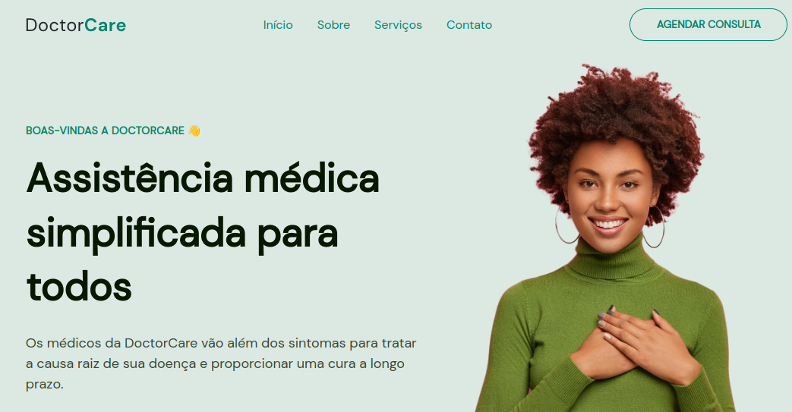

<h2 align="center">Doctor Care</h2>
 

     <a href="#Tecnologias">Tecnologias</a> • 
     <a href="#Deploy">Deploy</a> • 
      •
     <a href="#Licença">Licença</a> 

 

Doctor Care, uma landing page criada para mostrar informações como serviços, contatos, redes sociais da empresa.

 

## 🌄 Layout

 

<!-- ## ✅ Features

- [x] Comentar um post
- [x] Excluir um comentário -->

 

## 🛠 Tecnologias

Abaixo tecnologias que foram usadas no projeto

- NEXTJS
- TAILWINDCSS
- GIT
- GITHUB
- VERCEL

 

## 💿 Deploy

<a href="https://doctor-care-lake.vercel.app/">Projeto Online</a>

 

## 👨‍💻 Colaboradores

<table>
    <tr>
         <td align="center"><a href="https://brunogoncalvesferreira.com"> <b>Bruno Gonçalves</b></a> <a href="https://brunogoncalvesferreira.com" title="Bruno Gonçalves Ferreira">👨‍🚀</a></td>
    </tr>
</table>

 

## ✅ Licença

[MIT](https://github.com/brunogoncalvesferreira/doctor-care/blob/main/LICENSE)
